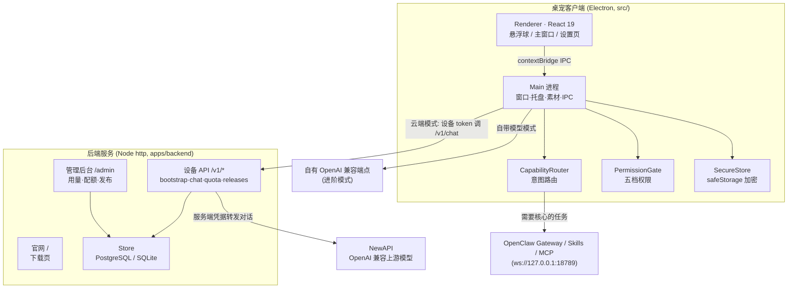

# MiniPet · 爪爪伙伴

> Windows 优先的中文桌宠：一只低打扰的小宠物负责入口、进度、权限确认与结果展示，真正的聊天、联网搜索、文档生成、浏览器与文件能力交给云端模型与本机 OpenClaw Gateway 执行。

[](#)
[](#)
[](#)
[](#)
[](#)
[](#许可证)
[](https://minipet.versecraft.cn)

## 这是什么

爪爪（MiniPet）是一个 **Windows 优先的中文桌宠 MVP**。它把「聊天、联网搜索、生成 PPT / Word / Excel、控制浏览器、整理文件」这些能力，包装成桌面上一只低打扰的小宠物：宠物只负责入口、进度提示、权限确认和结果展示，**真正执行任务的是云端模型（经后端转发 NewAPI）与本机的 OpenClaw Gateway / Skills / MCP**。

对用户来说门槛被压到最低——下载安装包、打开即用，基础聊天默认走 MiniPet 云端，无需手动填 API Key 或地址；进阶用户才需要在设置里切换到「自带模型 / API Key」模式。对运营方来说，仓库同时包含一套 Node 后端：对外提供官网下载页、设备配额 API 和管理后台，统一管控每台设备的 token 额度、内容安全词与版本发布。

仓库是一个 monorepo：`src/` 是 Electron 桌宠客户端，`apps/` 是后端服务、官网与管理后台静态资源。

## 🔗 在线体验

**https://minipet.versecraft.cn** —— 官网下载页，读取最新版本号、SHA256、安装包体积并提供 Windows 安装包下载。

## ✨ 核心特性

- **桌宠即入口，低打扰常驻**：主窗口与「悬浮球」两种桌面形态可互相收起/展开，支持置顶、点击穿透（`setIgnoreMouseEvents`）、拖拽移动与托盘菜单，不抢占工作区。
- **十态形象 + 素材自映射**：自动扫描素材目录里的 `png / jpg / jpeg / webp / gif`，按文件名关键词匹配到 Idle_Welcome / Listening / Thinking / Working_Guide / Success_Cheer / Idle_Calm / Surprised_Alert / Apology_Sad / Laptop_Working / pet_dragging 共十种状态；没有图片时回退到 CSS 绘制的占位宠物，也可在设置页手动映射。
- **意图路由（CapabilityRouter）**：把一句自然语言路由到 PPT / Word / Excel / 论文 / 找资料 / 联网 / 文件整理 / 浏览器 / 打开网页 / 桌面辅助等任务类型，并判断该任务是否需要联网核心（OpenClaw），缺主题时反问用户。
- **本地生成 Office 文档**：通过 `pptxgenjs` / `docx` / `exceljs` 在本机直接产出 PPTX / DOCX / XLSX，文档落到用户指定的输出目录。
- **双模型通道**：默认走 MiniPet 云端（设备 token + 配额），进阶可切到 OpenAI 兼容的自有端点；客户端在原始 Base URL 不可用时会自动回退到 `/v1` 规范化地址。
- **分级权限模型**：演示 / 安全 / 辅助 / 完全访问 / 管理员高级五档，按操作风险逐项放行。写文件、提交表单、付款、shell 等高风险动作需要确认或被默认阻断（见 `docs/PERMISSION_MODES.md`）。
- **安全默认值贯穿全栈**：渲染进程开启 `contextIsolation` / `sandbox`，不暴露 fs / shell / process / API Key / OpenClaw token；外链经 URL 白名单校验；密钥经 Electron `safeStorage` 加密存储；审计日志自动脱敏。
- **设备配额与管理后台**：后端为每台设备签发 token，默认 200 万 token 额度，带 IP 限流（默认 60 秒 60 次）、每日请求上限（默认 500 次）、敏感词拦截；管理员可在 `/admin` 查看用量、调整额度、禁用设备、登记新版本。
- **可自更新的发布链路**：`pnpm run dist:win` 产出安装包并生成 `release/latest.json` 与发布清单；客户端启动时向后端 `/v1/releases/latest` 检查更新并引导下载。

## 🏗 架构



数据流要点：基础聊天默认由客户端携设备 token 调用后端 `/v1/chat`，后端再以服务端持有的 NewAPI 凭据转发给上游模型；需要联网搜索 / 浏览器 / 文件等「核心能力」的任务由客户端经路由判断后交给本机 OpenClaw Gateway；进阶用户也可绕过云端，直连自有 OpenAI 兼容端点。

## 🧰 技术栈

| 维度 | 选型 | 说明 |
| --- | --- | --- |
| 桌面框架 | Electron 39 | Windows 优先；NSIS 安装包，`appId: cn.versecraft.minipet` |
| 渲染层 | React 19 + Vite 7 | 悬浮球 / 主窗口 / 设置页；`zustand` 管状态，`lucide-react` 图标 |
| 语言 | TypeScript 5.9 | 多 tsconfig 分别编译 main / renderer / server |
| 文档生成 | pptxgenjs / docx / exceljs | 本机生成 PPTX / DOCX / XLSX |
| 后端 | Node.js 22 原生 `http` + TypeScript | 无 Web 框架，纯路由实现；官网 + `/v1/*` API + `/admin` 后台同进程 |
| 存储 | PostgreSQL（`pg`）/ SQLite（`node:sqlite`） | 有 `DATABASE_URL` 用 Postgres，否则回退本地 SQLite |
| 鉴权 | 自实现 JWT + scrypt 口令哈希 | 设备 token 与管理员 token 分 kind 签发 |
| 上游模型 | NewAPI（OpenAI 兼容） | 凭据仅存于服务端 |
| 包管理 | pnpm 10.26.1 | `packageManager` 字段锁定版本 |
| 测试 | Vitest 4 | `tests/` 下 22 个用例，覆盖路由、权限、存储、URL 守卫等 |
| 容器 / 部署 | Docker + Coolify | 多阶段构建，仅打包后端，容器监听 `8080` |

## 🚀 快速开始

### 前置依赖

- Node.js 22+
- pnpm 10.26.1（仓库已用 `packageManager` 锁定，可 `corepack enable` 启用）
- 开发桌宠客户端建议在 Windows 上进行（产物为 Windows 安装包）

### 克隆与安装

```bash
git clone https://github.com/bei666qi-pan/minipet.git
cd minipet
pnpm install
```

### 本地运行桌宠客户端

```bash
pnpm run dev
```

`dev` 会先编译主进程，再并行启动 Vite（`http://127.0.0.1:5173`）与 Electron。首次启动进入引导页，默认值：素材目录 `design/one`、OpenClaw Gateway 尝试 `ws://127.0.0.1:18789`、API Base URL `https://newkey.versecraft.cn/`、安全模式默认开启。

### 本地运行后端 / 官网 / 管理后台

```bash
pnpm run build:server      # tsc -p tsconfig.server.json → dist-server/
pnpm run start:server      # node dist-server/index.js，默认监听 http://localhost:8080
```

启动后：官网在 `/`，设备 API 在 `/v1/*`，管理后台在 `/admin`。未配置 `DATABASE_URL` 时自动使用本地 SQLite（`.runtime-data/backend/minipet.sqlite`），仅适合本地开发。

### 打包 Windows 安装包

```bash
pnpm run dist:win
```

产物在 `release/`：NSIS 安装包 `MiniPetSetup-${version}-x64.exe`、可直接运行的 `win-unpacked` 目录，以及 `latest.json` 与 `release-manifest-${version}.json`（含版本号、SHA256、体积、渠道、发布时间）。

### 常用校验

```bash
pnpm run typecheck
pnpm test
pnpm run build
```

## ⚙️ 配置

仓库提供 `.env.example`（客户端默认值）。后端生产环境变量清单见 `docs/ENV_REQUIRED.md`。**所有密钥仅配置在 Coolify / GitHub Secrets / 主机环境中，切勿写入仓库或前端代码。**

| 变量 | 用途 |
| --- | --- |
| `MINIPET_WEB_ORIGIN` / `MINIPET_API_ORIGIN` / `MINIPET_DOWNLOAD_ORIGIN` | 官网 / API / 下载域名 |
| `NEWAPI_BASE_URL` / `NEWAPI_API_KEY` / `NEWAPI_DEFAULT_MODEL` | 上游模型凭据，**仅服务端持有** |
| `DATABASE_URL` | PostgreSQL 连接串；缺省回退本地 SQLite |
| `JWT_SECRET` | 签发设备 / 管理员 token，**生产环境必填**，缺失则拒绝以 production 启动 |
| `ADMIN_EMAIL` + `ADMIN_PASSWORD_HASH`（优先）或 `ADMIN_PASSWORD` | 管理后台登录 |
| `ADMIN_RELEASE_TOKEN` / `BACKEND_RELEASE_WEBHOOK_SECRET` | 登记新版本的发布 webhook 凭据 |
| `PORT` | 后端监听端口，默认 `8080` |
| `MINIPET_BLOCKED_WORDS` / `MINIPET_HIGH_RISK_WORDS` | 内容拦截 / 高风险词表 |
| `VOLCENGINE_*` | 安装包上传火山引擎 TOS / CDN 所需凭据（见 `docs/ENV_REQUIRED.md`） |

客户端侧（`.env.example`）：`OPENCLAW_GATEWAY_URL`、`OPENAI_COMPATIBLE_BASE_URL`、`OPENAI_COMPATIBLE_MODEL`。用户输入的 API Key / OpenClaw Token 经 `safeStorage` 加密，不写日志、不写死在代码里。

## 📁 目录结构

```text
minipet/
├── src/                      # Electron 桌宠客户端
│   ├── main/                 # 主进程：窗口/托盘/素材/IPC
│   │   ├── capabilities/     # CapabilityRouter 意图路由
│   │   ├── permissions/      # PermissionGate 五档权限 + RiskClassifier
│   │   ├── openclaw/         # OpenClaw 客户端 / mock / 协议
│   │   ├── cloud/            # MiniPetCloudClient 云端会话
│   │   ├── llm/              # OpenAI 兼容模型客户端
│   │   ├── memory/           # 本地对话记忆
│   │   ├── output/           # PPTX/DOCX/XLSX 生成
│   │   ├── security/         # URL 守卫 / 审计脱敏
│   │   └── secureStore.ts    # safeStorage 密钥存储
│   └── renderer/             # React UI：悬浮球/主窗口/设置页
├── apps/
│   ├── backend/src/          # Node http 后端（API + 官网 + 后台），构建入口
│   ├── website/              # 官网下载页静态资源
│   └── admin/                # 管理后台静态资源
├── design/                   # 桌宠素材目录（one / two）
├── scripts/                  # 发布清单生成、TOS 上传、冒烟脚本
├── tests/                    # Vitest 单元测试
├── docs/                     # 部署、权限、OpenClaw 集成等文档
├── Dockerfile                # 后端多阶段构建
└── electron-builder.yml      # Windows 打包配置
```

## 部署

本项目属 VerseCraft 系列，遵循统一部署链路：**GitHub（事实源） → Gitee 镜像 → Coolify（火山引擎 ECS）**。

- **后端 / 官网 / 管理后台**：用仓库内 `Dockerfile` 多阶段构建（只编译并打包后端，`pnpm run build:server` → `dist-server/index.js`，入口 `apps/backend/src/index.ts`），容器暴露 `8080`，由 Coolify 部署；生产变量按 `docs/ENV_REQUIRED.md` 注入，域名 `minipet.versecraft.cn` 与 `api.minipet.versecraft.cn` 指向该服务。详见 `docs/DEPLOYMENT.md` 与 `docs/COOLIFY_MANUAL_STEPS.md`。
- **Windows 安装包**：GitHub Actions `.github/workflows/build-windows.yml` 在 `main` 上跑 `pnpm test` + `pnpm run typecheck` 并执行 `pnpm run dist:win` 构建安装包；`pnpm run release:upload` 将安装包上传至火山引擎 TOS，更新 `latest/MiniPetSetup.exe` 与 `latest/latest.json`，并校验公开 CDN 地址（需在环境变量里配置 `VOLCENGINE_*` 凭据）。
- **版本登记**：官网通过后端 `/v1/releases/latest` 读取当前版本（无记录时回退到配置默认值与 CDN 上的 `latest/latest.json`）；将新版本写入后端 Store，需经管理后台或 `/admin/releases/publish` 发布 webhook（凭 `ADMIN_RELEASE_TOKEN`）完成，与 TOS 上传相互独立。

凭据（NewAPI、数据库口令、JWT、Coolify token、火山 AK/SK 等）一律不入库、不入前端、不入安装包；后端日志在打印前对 authorization / token / api key / password / secret 等字段脱敏。

## 安全

- 渲染端默认：`nodeIntegration: false`、`contextIsolation: true`、`sandbox: true`、`webSecurity: true`，不暴露 fs / shell / process / API Key / OpenClaw token。
- 外链、文件、OpenClaw 方法均经过权限与白名单校验；高风险操作写入自动脱敏的审计日志。
- 后端：IP 限流、设备每日请求上限、敏感词拦截、JWT 鉴权、scrypt 口令哈希存储。
- 详见 [SECURITY.md](./SECURITY.md) 与 [docs/PERMISSION_MODES.md](./docs/PERMISSION_MODES.md)。

## 许可证

`package.json` 声明为 **MIT** 许可证；仓库未单独包含 LICENSE 文件。
